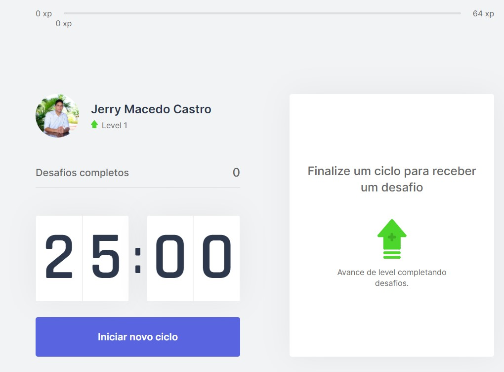

Um projeto [Next.js](https://nextjs.org/) criado com [`create-next-app`](https://github.com/vercel/next.js/tree/canary/packages/create-next-app).

## Funcionamento

O Move it é criado para ajudar pessoas que passam muito tempo na frente do computador. Ao entrar é possível iniciar um ciclo e ao término de 25 minutos a aplicação irá notificar que está na hora de fazer algum exercicio. Além disso é possivel completar ou falhar no desafio. Cada desafio tem uma quantidade de xp que é acrescida conforme os desafios são completados. As informações de xp, deafios concluidos e level são salvas através de cookies no navegador.




> Os exercicios estão fixamente cadastrados num arquivo json (challenges.json)

## Tecnologias utilizadas

- React
- Typescript
- Context API
- Next.js
- CSS modules

## Iniciando o desenvolvimento

Primeiro, faça o clone do repositório e instale as dependências:

```
npm install
# or
yarn
```

Agora, rode o projeto no ambiente de desenvolvimento:

```bash
npm run dev
# or
yarn dev
```

Abra o caminho [http://localhost:3000](http://localhost:3000) com o navegador e veja o resultado.

## Publicação na Vercel

A publicação é feita automáticamente na Vercel quando a branch main é atualizada.
